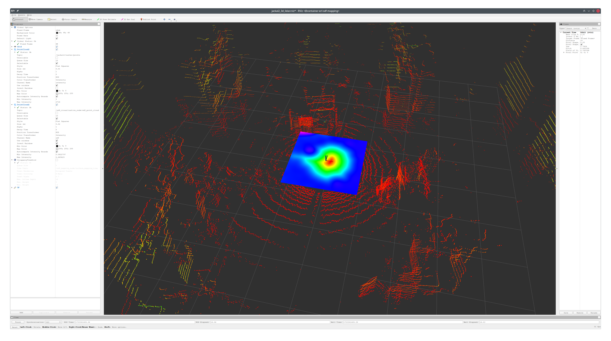

# erl_gp_sdf_ros

[](https://opensource.org/licenses/MIT)
[](http://wiki.ros.org/)
[](https://docs.ros.org/)
[](https://docs.ros.org/)

|                                   |                                          |
| --------------------------------- | ---------------------------------------- |
|  |  |

**A ROS package for Gaussian Process regression on Signed Distance Fields.**

`erl_gp_sdf_ros` is a ROS wrapper package for the 🚪[erl_gp_sdf](https://github.com/ExistentialRobotics/erl_gp_sdf) library, providing nodes for real-time SDF mapping and visualization using Gaussian Process regression. The package supports both ROS1 (Noetic) and ROS2 (Humble) distributions.

## Features

- **SDF Mapping**: Real-time signed distance field estimation using Gaussian Process regression
- **Different Sensors**: Support for various sensor types (LiDAR, depth cameras, point clouds)
- **Visualization**: Real-time SDF visualization using grid maps and RViz
- **Mapping Quality**: Uncertainty-aware mapping with variance estimation
- **ROS Support**: Compatible with both ROS1 and ROS2
- **Multiple Demos**: Pre-configured demonstrations for different scenarios

## Getting Started

### Prerequisites

- ROS1 Noetic or ROS2 Humble
- C++17 compatible compiler
- CMake 3.24 or higher

### Create Workspace

```bash
mkdir -p <your_workspace>/src && \
vcs import --input https://raw.githubusercontent.com/ExistentialRobotics/erl_gp_sdf_ros/refs/heads/main/erl_gp_sdf_ros.repos <your_workspace>/src
```

### Dependencies

This package depends on the following ERL packages:
- [erl_cmake_tools](https://github.com/ExistentialRobotics/erl_cmake_tools)
- [erl_common](https://github.com/ExistentialRobotics/erl_common)
- [erl_common_ros](https://github.com/ExistentialRobotics/erl_common_ros)
- [erl_covariance](https://github.com/ExistentialRobotics/erl_covariance)
- [erl_gaussian_process](https://github.com/ExistentialRobotics/erl_gaussian_process)
- [erl_geometry](https://github.com/ExistentialRobotics/erl_geometry)
- [erl_geometry_msgs](https://github.com/ExistentialRobotics/erl_geometry_msgs)
- [erl_geometry_rviz_plugin](https://github.com/ExistentialRobotics/erl_geometry_rviz_plugin)
- [erl_geometry_ros](https://github.com/ExistentialRobotics/erl_geometry_ros)
- [erl_gp_sdf](https://github.com/ExistentialRobotics/erl_gp_sdf)
- [erl_gp_sdf_msgs](https://github.com/ExistentialRobotics/erl_gp_sdf_msgs)

```bash
# Ubuntu 20.04
wget -qO - https://raw.githubusercontent.com/ExistentialRobotics/erl_common/refs/heads/main/scripts/setup_ubuntu_20.04.bash | bash
wget -qO - https://raw.githubusercontent.com/ExistentialRobotics/erl_geometry/refs/heads/main/scripts/setup_ubuntu_20.04.bash | bash
# Ubuntu 22.04, 24.04
wget -qO - https://raw.githubusercontent.com/ExistentialRobotics/erl_common/refs/heads/main/scripts/setup_ubuntu_22.04_24.04.bash | bash
wget -qO - https://raw.githubusercontent.com/ExistentialRobotics/erl_geometry/refs/heads/main/scripts/setup_ubuntu_22.04_24.04.bash | bash
```

Standard ROS dependencies:
- `geometry_msgs`
- `sensor_msgs`
- `std_msgs`
- `grid_map_ros`
- `grid_map_msgs`
- `tf2_ros`
- `tf2_eigen`
- `tf2_geometry_msgs`

### Docker Option (Recommended)

The easiest way to get started is to use the provided [Docker files](./docker), which contains all dependencies.

```bash
cd <your_workspace>
ROS_DISTRO=<ros_distro> ./src/erl_gp_sdf_ros/scripts/build_docker.bash

# Create and enter container
./src/erl_gp_sdf_ros/scripts/create_container.bash
./src/erl_gp_sdf_ros/scripts/login_container.bash
```

### Building the Package

```bash
cd <your_workspace>
# for ROS1
catkin build erl_gp_sdf_ros
source devel/setup.bash
# for ROS2
colcon build --packages-up-to erl_gp_sdf_ros
source install/setup.bash
```

## Available Nodes

### 1. `sdf_mapping_node`

Performs real-time SDF mapping using Gaussian Process regression. The node subscribes to sensor data, maintains a probabilistic surface mapping, and provides an SDF query service.

**Subscribed Topics (one of the following for sensor data):**
- Laser scan topic (sensor_msgs/LaserScan): 2D laser scan data
- Point cloud topic (sensor_msgs/PointCloud2): 3D point cloud data
- Depth image topic (sensor_msgs/Image): Depth camera images
- Odometry topic (nav_msgs/Odometry or geometry_msgs/TransformStamped): Robot pose (optional)

**Published Topics:**
- `surface_mapping_tree` (erl_geometry_msgs/OccupancyTreeMsg): Occupancy tree used by surface mapping (optional)
- `surface_points` (sensor_msgs/PointCloud2): Surface points with position, normal, and variance information (optional)
- `update_time` (sensor_msgs/Temperature): Time taken for map updates (for performance monitoring)
- `query_time` (sensor_msgs/Temperature): Time taken for SDF queries (for performance monitoring)

**Published Services:**
- `sdf_query` (erl_gp_sdf_msgs/SdfQuery): Query SDF values, gradients, and uncertainties at specified points
- `save_map` (erl_gp_sdf_msgs/SaveMap): Save the current SDF map to file

**Key Parameters:**

*Core Configuration:*
- `setting_file` (string): Optional YAML file to load all parameters from (default: "")
- `map_dim` (int): Map dimensionality, 2 for 2D or 3 for 3D mapping (default: 3)
- `double_precision` (bool): Whether to use double precision floating point (default: false)
- `surface_mapping_setting_type` (string): Class name for surface mapping setting (required)
- `surface_mapping_setting_file` (string): Path to surface mapping configuration file (required)
- `surface_mapping_type` (string): Surface mapping algorithm class name (required)
- `sdf_mapping_setting_file` (string): Path to SDF mapping configuration file (required)

*Sensor Configuration:*
- `scan_topic` (string): Topic name for sensor data (default: "/front/scan")
- `scan_type` (string): Sensor message type - ROS1: "sensor_msgs/LaserScan", "sensor_msgs/PointCloud2", "sensor_msgs/Image"; ROS2: "sensor_msgs/msg/LaserScan", "sensor_msgs/msg/PointCloud2", "sensor_msgs/msg/Image" (default: varies by ROS version)
- `scan_frame_type` (string): Scan frame class name (e.g., "erl::geometry::LidarFrame3D<float>")
- `scan_frame_setting_file` (string): Path to scan frame configuration file
- `scan_stride` (int): Downsampling factor for scan data (default: 1)
- `convert_scan_to_points` (bool): Whether to convert non-point cloud scans to points (default: false)
- `scan_in_local_frame` (bool): Whether scan data is in sensor's local frame (default: false)
- `depth_scale` (float): Scale factor for depth images, e.g., 0.001 converts mm to m (default: 0.001)

*Frame Configuration:*
- `world_frame` (string): World coordinate frame (default: "map")
- `sensor_frame` (string): Sensor coordinate frame (default: "front_laser")

*Odometry Configuration:*
- `use_odom` (bool): Whether to use odometry for sensor pose (default: false)
- `odom_topic` (string): Odometry topic name (default: "/jackal_velocity_controller/odom")
- `odom_msg_type` (string): Odometry message type - ROS1: "nav_msgs/Odometry" or "geometry_msgs/TransformStamped"; ROS2: "nav_msgs/msg/Odometry" or "geometry_msgs/msg/TransformStamped" (default: varies by ROS version)
- `odom_queue_size` (int): Size of odometry message queue (default: 100)

*Publishing Configuration:*
- `publish_tree` (bool): Whether to publish occupancy tree (default: false)
- `publish_tree_topic` (string): Topic name for occupancy tree (default: "surface_mapping_tree")
- `publish_tree_binary` (bool): Whether to use binary format for tree messages (default: true)
- `publish_tree_frequency` (double): Publishing frequency for occupancy tree in Hz (default: 5.0)
- `publish_surface_points` (bool): Whether to publish surface points (default: false)
- `publish_surface_points_topic` (string): Topic name for surface points (default: "surface_points")
- `publish_surface_points_frequency` (double): Publishing frequency for surface points in Hz (default: 5.0)

### 2. `sdf_visualization_node`

Provides visualization of SDF maps by querying the SDF mapping service and publishing results as grid maps and point clouds.

**Services Used:**
- SDF query service (erl_gp_sdf_msgs/SdfQuery): Queries SDF values from the mapping node

**Published Topics:**
- Grid map topic (grid_map_msgs/GridMap): SDF values, gradients, and uncertainties as grid map layers (optional)
- Point cloud topic (sensor_msgs/PointCloud2): SDF visualization as colored point cloud (optional)

**Key Parameters:**
- `resolution` (double): Grid resolution for visualization (default: 0.1)
- `x_cells` (int): Number of grid cells in X direction (default: 101, must be odd)
- `y_cells` (int): Number of grid cells in Y direction (default: 101, must be odd)
- `x`, `y`, `z` (double): Grid center position (default: 0.0)
- `service_name` (string): Name of SDF query service (default: "sdf_query")
- `map_topic_name` (string): Topic name for grid map output (default: "sdf_grid_map")
- `point_cloud_topic_name` (string): Topic name for point cloud output (default: "sdf_point_cloud")
- `publish_grid_map` (bool): Whether to publish grid map (default: true)
- `publish_point_cloud` (bool): Whether to publish point cloud (default: true)
- `publish_gradient` (bool): Whether to include gradient information (default: false)
- `publish_sdf_variance` (bool): Whether to include SDF variance (default: false)
- `publish_gradient_variance` (bool): Whether to include gradient variance (default: false)
- `publish_covariance` (bool): Whether to include covariance information (default: false)
- `attached_to_frame` (bool): Whether visualization follows a moving frame (default: false)
- `attached_frame` (string): Frame to follow when attached_to_frame is true (default: "map")
- `world_frame` (string): World coordinate frame (default: "map")
- `publish_rate` (double): Visualization update frequency in Hz (default: 2.0)

## Usage Examples

### 1. Gazebo Room 2D Simulation


Launch the 2D room simulation with SDF mapping:

```bash
# ROS1
roslaunch erl_gp_sdf_ros gazebo_room_2d.launch

# ROS2
ros2 launch erl_gp_sdf_ros gazebo_room_2d_launch.py
```

This demonstration shows SDF mapping in a simulated 2D environment with synthetic laser scan data.

### 2. Cow and Lady Dataset


Launch the Cow and Lady dataset visualization:

```bash
# ROS1
roslaunch erl_gp_sdf_ros cow_and_lady.launch

# ROS2
ros2 launch erl_gp_sdf_ros cow_and_lady_launch.py
```

**Note:** Set the following launch file parameters:
- `cow_and_lady_bag`: Path to the dataset bag file
- `gt_point_cloud_file`: Path to the ground truth point cloud file

### 3. Jackal 3D LiDAR Demo


Launch the 3D LiDAR mapping demonstration:

```bash
# ROS1
roslaunch erl_gp_sdf_ros jackal_3d_lidar.launch

# ROS2
ros2 launch erl_gp_sdf_ros jackal_3d_lidar_launch.py
```

This demo shows 3D SDF mapping using LiDAR data from a Jackal robot.

### 4. ZED Camera Demo


Launch the ZED stereo camera demonstration:

```bash
# ROS1
roslaunch erl_gp_sdf_ros zed_camera.launch

# ROS2
ros2 launch erl_gp_sdf_ros zed_camera_launch.py
```

This demo demonstrates SDF mapping using depth data from a ZED stereo camera.

## RViz Configurations

Pre-configured RViz files are available in the `rviz/` directory for ROS1 or `rviz2/` for ROS2:
- `gazebo_room_2d.rviz`: Configuration for 2D simulation
- `cow_and_lady.rviz`: Configuration for Cow and Lady dataset
- `jackal_3d_lidar.rviz`: Configuration for 3D LiDAR visualization
- `zed_camera.rviz`: Configuration for camera-based mapping

## Docker Usage

We provide Dockerfiles for different ROS distributions in the [docker](./docker) directory. Please
run the `build.bash` script along with the Dockerfile to build the image you need.

## License

This project is licensed under the MIT License - see the [LICENSE](LICENSE) file for details.
